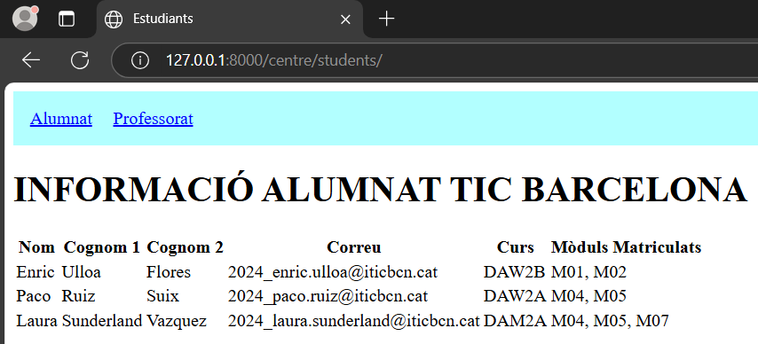
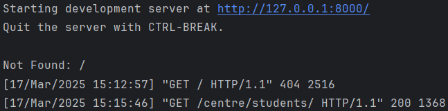
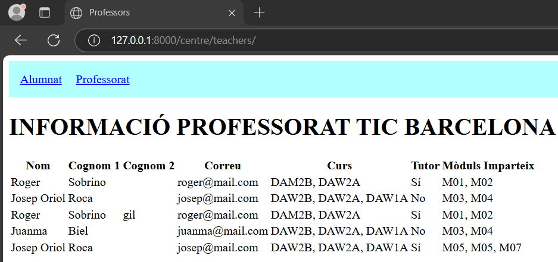
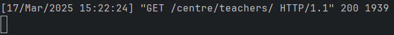
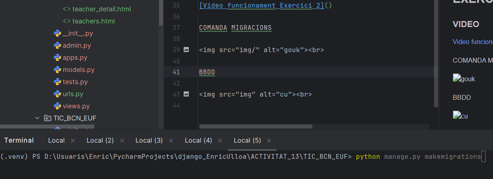
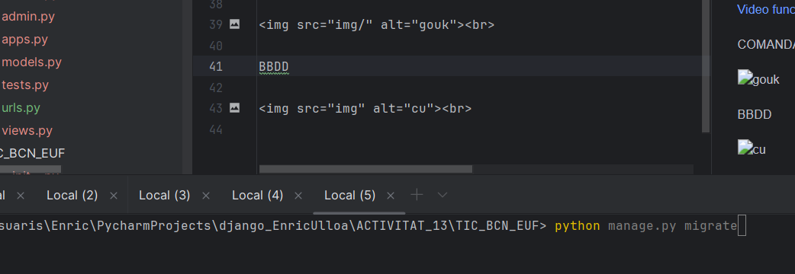
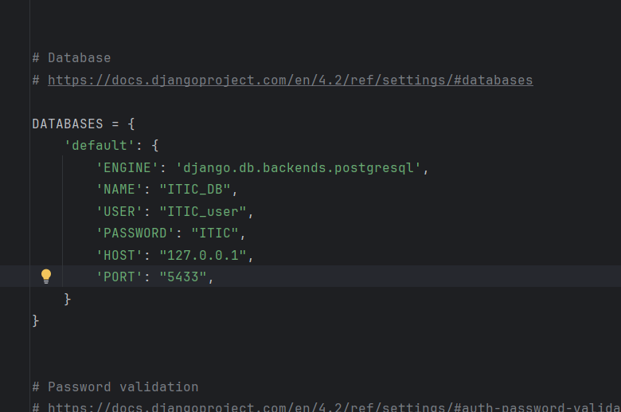
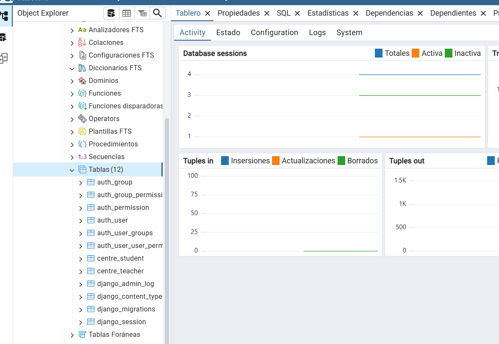

# ACTIVITAT 13 - DJANGO INTRO

## EXERCICI 1

### URL centre/students

APLICACIÓ

 

PROJECTE

 

### URL centre/teachers

APLICACIÓ

 

PROJECTE

 

## EXERCICI 2

### VIDEO

[Video funcionament Exercici 2](https://drive.google.com/file/d/1LN4TcWQvhK0qjjnnYDDaYMbfI13Eg7PP/view?usp=sharing)

## EXERCICI 3

### VIDEO

[Video demostració Exercici 3](https://drive.google.com/file/d/16-XZdnKzgHRwCqqJ2iIMJsfC1fSCshyv/view?usp=sharing)

COMANDA MIGRACIONS

 

 

BBDD

 

 
