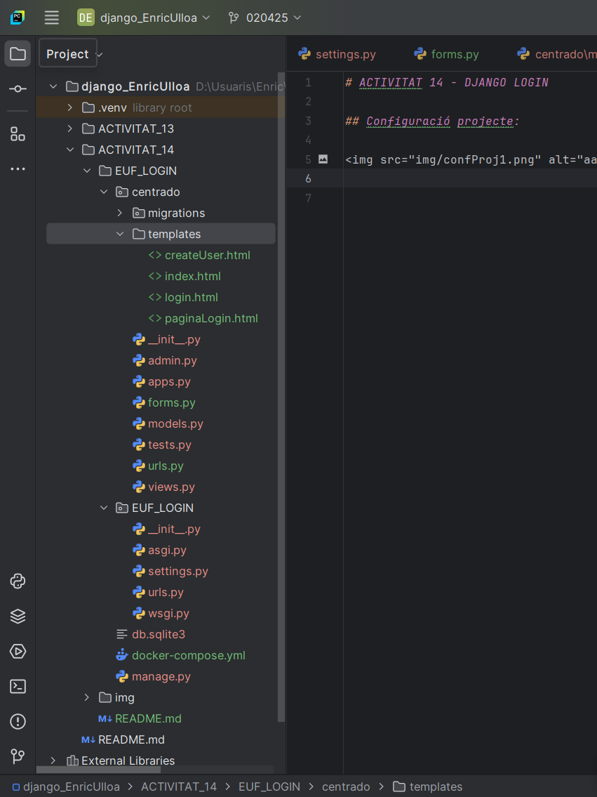
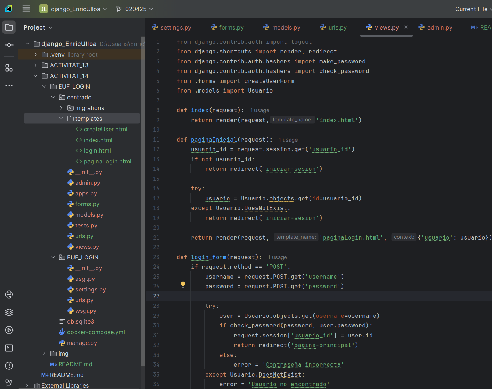
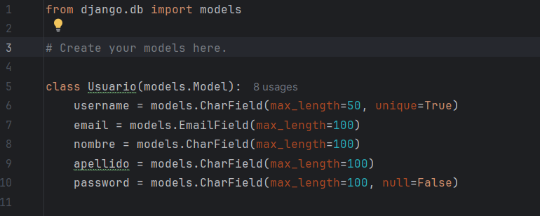
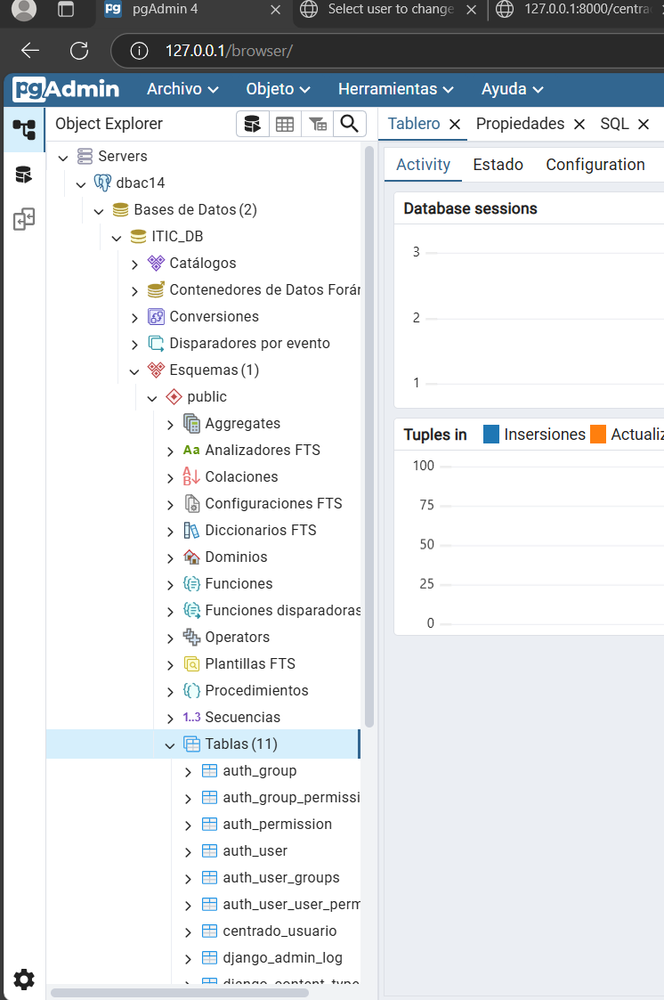
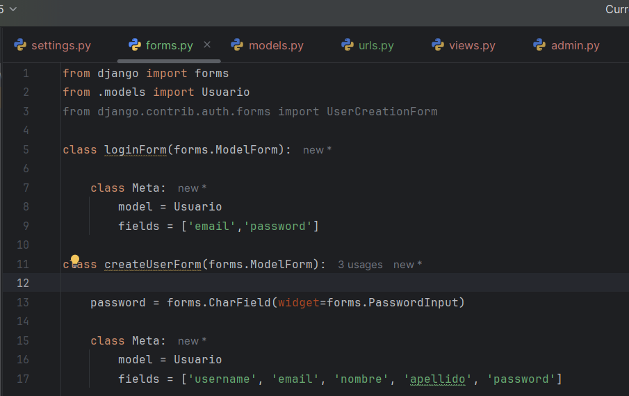
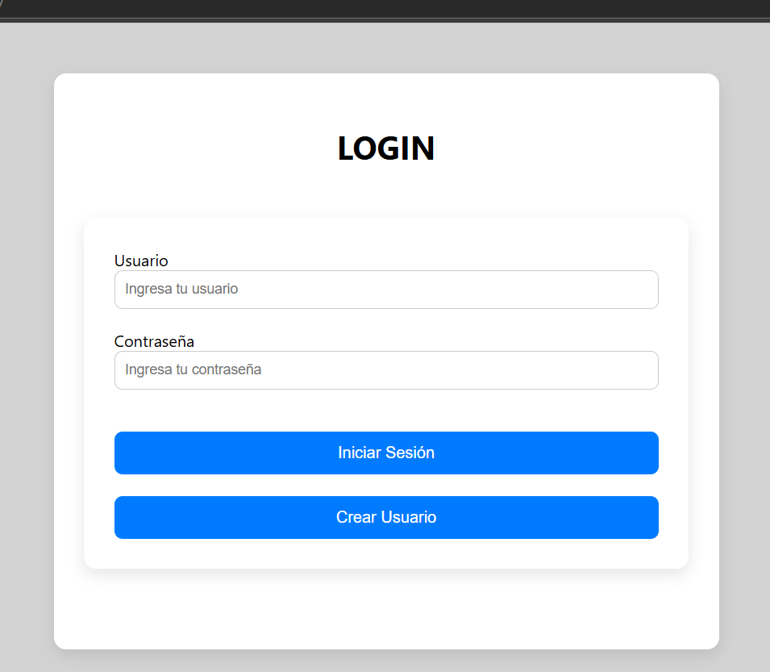
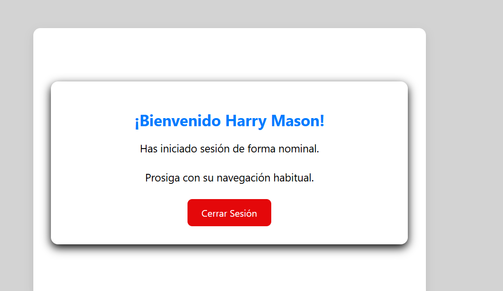
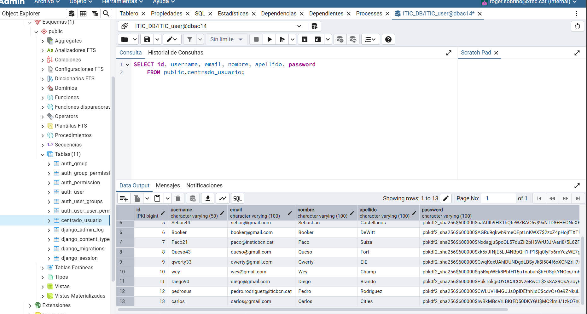

# ACTIVITAT 14 - DJANGO LOGIN

## Configuració projecte:

 

## Crear la nova aplicació:

 

## Crear el model de l’aplicació:

 - models.py

 

 - pgAdmin

 

## Crear el formulari del login:

 - forms.py

 

## Vista login sense sessió i Vista login AMB sessió:

 

## Vista inici de sessió:

 

## Capturas extra:

 
